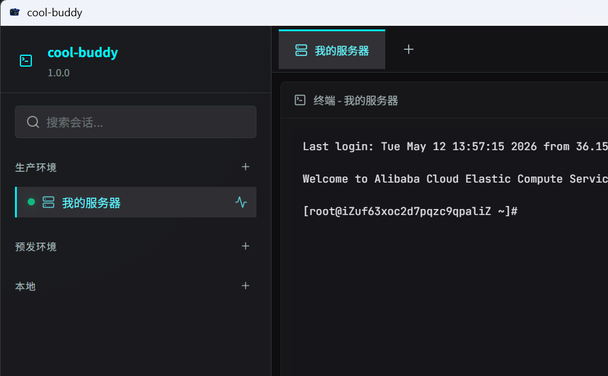

# cool-buddy

[中文](#中文) | [English](#english)



## 中文

`cool-buddy` 是一个面向服务器运维、远程排障和日常巡检的桌面工作台。它把 SSH 终端、实时日志、远程文件浏览、资源指标和内置 AI 助手放进同一个 Electron 应用里，减少在终端、SFTP、监控页和临时脚本之间来回切换的成本。

### 为什么做这个

很多线上处理工作并不难，难的是上下文总被拆散：

- 一个窗口连 SSH
- 一个窗口盯日志
- 一个工具传文件
- 另一个页面看 CPU、内存和 Docker
- 真要分析问题时，还要自己整理现场信息

`cool-buddy` 想解决的就是这件事：把一台远程机器的排障视角尽量收拢到同一个界面里。

### 适合谁

- 需要频繁登录 Linux 服务器的开发者和运维
- 经常处理部署、巡检、线上告警和日志排查的工程团队
- 想把 SSH、日志和文件操作集中到一个桌面工具里的个人用户

### 当前功能

#### 1. SSH 会话工作台

- 多会话管理，支持快速切换
- 顶部标签页视图，支持关闭当前、关闭其他、关闭全部
- 会话分组和图标类型区分
- 支持保存主机、端口、用户名等基础信息
- 支持密码登录和系统 SSH Key 登录
- 自动探测本机默认私钥和 `ssh-agent`
- 可记住上次会话并恢复工作上下文

#### 2. 内置远程终端

- 基于 `xterm.js` 的内嵌终端体验
- 连接后直接在应用内执行远程命令
- 自动适配终端尺寸变化
- 支持复制选中内容
- 支持剪贴板粘贴
- 多行命令粘贴前会先确认，避免误执行整段脚本
- 支持逐行发送多行命令

#### 3. 实时日志面板

- 在界面内直接对远程日志执行 `tail -f`
- 支持同时打开多个日志流
- 支持设置初始加载和保留的日志行数
- 支持单独弹出日志窗口，方便多屏查看
- 会在路径错误、连接中断等场景下给出明确反馈

#### 4. 远程文件浏览器

- 浏览远程目录和文件
- 预览文件内容
- 上传文件
- 新建目录
- 重命名文件或目录
- 删除远程条目
- 显示 / 隐藏隐藏文件

#### 5. 资源概览与巡检信息

- 查看主机名
- 查看 CPU 使用率
- 查看内存使用情况
- 查看 Docker 运行实例数
- 支持刷新和展开更多细节

#### 6. 内置 AI 助手

- 支持配置 OpenAI-compatible / Anthropic 等模型提供方
- 可直接基于当前会话上下文提问
- 内置快捷提示词，例如主机健康检查、运行中应用、日志检查
- 对高风险操作提供分级确认
- 审批弹窗会展示摘要、细节和待执行命令

#### 7. 国际化与桌面体验

- 顶栏支持语言切换
- 已接入多语言文案框架
- 托盘、窗口状态和桌面工作流已经打通

### 技术栈

- Electron
- Vue 3
- TypeScript
- Pinia
- Vue Router
- xterm.js
- ssh2
- better-sqlite3
- LangChain

### 本地开发

安装依赖：

```bash
pnpm install
```

启动开发环境：

```bash
pnpm dev
```

类型检查与构建：

```bash
pnpm build
```

按平台打包：

```bash
pnpm build:win
pnpm build:mac
pnpm build:linux
```

### 发布说明

GitHub Release 工作流会为当前项目构建并上传：

- Windows 安装包：`*-setup.exe`
- macOS Apple Silicon 安装包：`*.dmg`

发布时建议直接从 GitHub Release 下载对应平台安装包。

### 项目结构

```text
src/main       Electron 主进程、IPC、SSH 与系统能力
src/preload    preload 桥接层
src/renderer   Vue 渲染层界面
resources      README 截图等资源
build          打包图标与安装器配置
scripts        构建辅助脚本
```

### 目前定位

`cool-buddy` 不是一个单纯的终端模拟器，它更像一个偏运维工作流的远程桌面控制台：

- 连上服务器
- 打命令
- 看日志
- 找文件
- 查资源
- 让 AI 帮忙总结现场或辅助判断

如果你每天都在这些动作之间切换，它会比“把几种工具拼在一起”更顺手。

### License

[MIT](./LICENSE)

---

## English

`cool-buddy` is a desktop workspace for server operations, remote troubleshooting, and day-to-day infrastructure checks. It brings SSH access, live logs, remote file browsing, host metrics, and an embedded AI assistant into one Electron app so you spend less time bouncing between terminal windows, SFTP tools, monitoring tabs, and scratch notes.

### Why it exists

Most production tasks are not difficult because of a single command. They get messy because the context is fragmented:

- one window for SSH
- another one for logs
- another tool for file transfer
- another page for CPU, memory, and Docker
- and then manual reasoning on top of all of that

`cool-buddy` is built to keep that operational context in one place.

### Who it is for

- developers and operators who regularly log into Linux hosts
- teams handling deployments, incident response, and routine health checks
- anyone who wants a tighter desktop workflow around SSH-based operations

### Current features

#### 1. SSH session workspace

- multi-session management with fast switching
- top tab bar with close-current, close-others, and close-all actions
- session grouping and per-session icon types
- saved host, port, username, and connection metadata
- password auth and system SSH key auth
- automatic detection of default local keys and `ssh-agent`
- restore-last-session style continuity

#### 2. Built-in remote terminal

- embedded terminal powered by `xterm.js`
- run remote commands directly inside the app
- automatic terminal resize handling
- copy selected terminal text
- clipboard paste support
- multi-line paste confirmation to reduce accidental script execution
- send multi-line commands line by line when needed

#### 3. Live log panel

- run remote `tail -f` without leaving the app
- track multiple log streams at the same time
- configure initial load and rolling line limits
- pop log streams out into their own window
- clear feedback for invalid paths, disconnects, and stream errors

#### 4. Remote file explorer

- browse remote directories and files
- preview file contents
- upload files
- create folders
- rename files and directories
- delete remote entries
- show or hide hidden files

#### 5. Host metrics and inspection

- hostname summary
- CPU usage
- memory usage
- running Docker instance count
- refresh controls and expanded details

#### 6. Embedded AI assistant

- supports OpenAI-compatible and Anthropic-style providers
- ask questions in the context of the current remote session
- built-in prompts for host health, running apps, and log checks
- risk-tier approvals for sensitive actions
- approval dialogs show a summary, details, and the pending command

#### 7. Internationalization and desktop polish

- language switcher in the top bar
- multi-language copy framework already wired in
- tray and desktop-window workflow support

### Tech stack

- Electron
- Vue 3
- TypeScript
- Pinia
- Vue Router
- xterm.js
- ssh2
- better-sqlite3
- LangChain

### Local development

Install dependencies:

```bash
pnpm install
```

Start the Tauri app in the same workspace:

```bash
pnpm tauri:dev
```

Start the dev app:

```bash
pnpm dev
```

Type-check and build:

```bash
pnpm build
```

Platform packaging:

```bash
pnpm build:win
pnpm build:mac
pnpm build:linux
pnpm tauri:build
```

### Releases

The GitHub Release workflow builds and uploads:

- Windows installer: `*-setup.exe`
- macOS Apple Silicon installer: `*.dmg`

For distribution, download the platform-specific installer directly from GitHub Releases.

### Project structure

```text
src/main       Electron main process, IPC, SSH, and system capabilities
src/preload    preload bridge layer
src/renderer   Vue renderer UI
resources      README assets and screenshots
build          packaging assets and installer configuration
scripts        build helper scripts
```

### Positioning

`cool-buddy` is not just a terminal emulator. It is closer to an operations-oriented remote workstation:

- connect to a host
- run commands
- inspect logs
- browse files
- check machine health
- let AI help summarize the situation

If that is already your daily loop, this should feel much more coherent than stitching together several separate tools.

### License

[MIT](./LICENSE)
